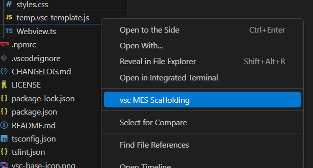

# vsc-MES-scaffolding

An extention off of vsc-scaffolding

Instead of VS Code prompting you for a template type and name, a webview opens up and allows you to view current templates and create new components.

## Installation Notes:

Run both npm install and code --install from project directory root

## Credits
This is an extension based on [vsc-scaffolding](https://github.com/alfnielsen/vsc-base/tree/master/vsc-scaffolding).
All credit goes to [Alf Nielsen](https://github.com/alfnielsen) for their initial work

# vsc-scaffolding

The is an vscode extension.

The project's main goal is to create an easy way the create scaffolding templates.

