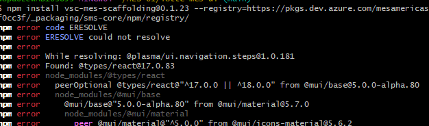

# vsc-mes-scaffolding

An extention off of vsc-scaffolding

Instead of being prompted for a template type and name, a webview opens allowing you to view existing templates and create new components.

# Installation Notes:

Run these commands to install the extention:

    npm install vsc-mes-scaffolding@[current-version] --registry=[artifact-registry]

    code --install-extension node_modules/vsc-mes-scaffolding/vsc-mes-scaffolding-[current-version].vsix

You do NOT have to be in any specific directory

## Installation Errors:

If you encounter a dependency clash, you have two options:

- Try both commands in a different directory

Or

- Use the --legacy-peer-deps flag when installing. For Example:

    npm install vsc-mes-scaffolding@0.1.23 --legacy-peer-deps

## Credits
This is an extension based on [vsc-scaffolding](https://github.com/alfnielsen/vsc-base/tree/master/vsc-scaffolding).
All credit goes to [Alf Nielsen](https://github.com/alfnielsen) for their initial work

# vsc-scaffolding

The is an vscode extension.

The project's main goal is to create an easy way the create scaffolding templates.

